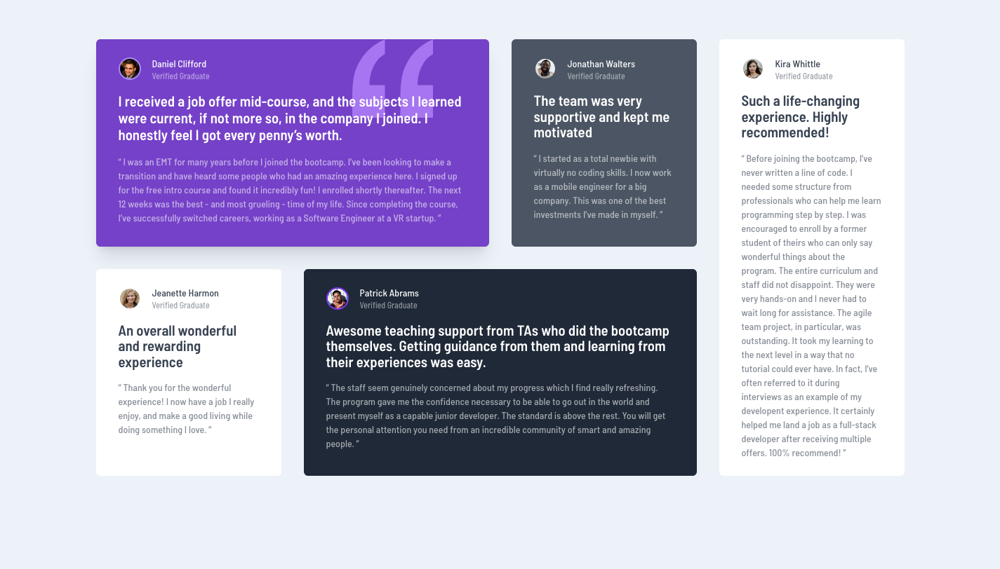

# Frontend Mentor - Testimonials grid section solution

This is a solution to the [Testimonials grid section challenge on Frontend Mentor](https://www.frontendmentor.io/challenges/testimonials-grid-section-Nnw6J7Un7). Frontend Mentor challenges help you improve your coding skills by building realistic projects.

## Table of contents

- [Overview](#overview)
  - [The challenge](#the-challenge)
  - [Screenshot](#screenshot)
  - [Links](#links)
- [My process](#my-process)
  - [Built with](#built-with)
  - [What I learned](#what-i-learned)
- [Author](#author)

## Overview

### The challenge

Users should be able to:

- View the optimal layout for the site depending on their device's screen size

### Screenshot

### Links

- Solution URL: [Add solution URL here](https://github.com/tomhine/fm-grid-section)
- Live Site URL: [Add live site URL here](https://reverent-franklin-c514cb.netlify.app/)

## My process

### Built with

- Flexbox
- CSS Grid
- Mobile-first workflow
- [Tailwind CSS](https://tailwindcss.com/) - Utility-First CSS Framework
- [Astro](https://astro.build/) - Static Site Builder

### What I learned

This was my first time using the Astro Framework. I've really enjoyed it, definitely going to keep on using it for any static sites. I love writing html, css and javascript in a really fundamental way, but also being able to use components and scoped styling etc.

## Author

- Frontend Mentor - [@tomhine](https://www.frontendmentor.io/profile/tomhine)
- Twitter - [@tomehine](https://www.twitter.com/tomehine)
